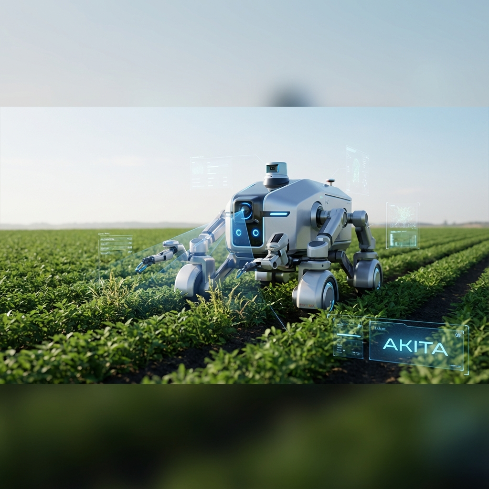

# AKITA - Autonomous Weed Removal Robot

<div align="center">
  
  <br />
  <br />
  
  [](https://opensource.org/licenses/MIT)
  []()
  []()
  
  <h1>Ottonom Tarımsal Yaban Ot Temizleme Robotu</h1>
</div>

## 📖 Hakkında (About)
**AKITA**, tarım arazilerindeki istenmeyen yaban otlarını tespit edip temizleyerek tarımsal verimliliği artırmayı hedefleyen otonom bir araç projesidir. **Mavi Alp Bilgi Teknolojileri** takımı tarafından **Teknofest 2022** kapsamında geliştirilmiştir.

Projemiz, sürdürülebilir tarım teknikleri ve yapay zeka teknolojilerini bir araya getirerek çiftçilere çevre dostu bir çözüm sunmaktadır.

## 🌟 Özellikler (Features)
- **Otonom Navigasyon:** Tarlada kendi yolunu bulur.
- **Yapay Zeka Destekli Tespit:** Yaban otlarını ekinlerden ayırt eder.
- **Hassas Müdahale:** Sadece hedeflenen otları temizler.
- **Uzaktan İzleme:** Web tabanlı kontrol paneli ile anlık takip.

## 🛠️ Teknolojiler (Technologies)
- **Arayüz:** HTML5, Tailwind CSS
- **Etkileşim:** JavaScript (ES6+)
- **Robotik:** ROS (Robot Operating System) - *Gömülü sistem tarafında*

## 👥 Takım Üyeleri (Team Members)
| İsim | Görev |
| --- | --- |
| **Doç. Dr. Sedat GÖRMÜŞ** | Danışman |
| **Hakan AYDIN** | Takım Kaptanı |
| **Bünyamin ŞENEL** | Elektronik Birim Sorumlusu |
| **Muhammed FİDAN** | Mekanik Birim Sorumlusu |
| **Ahmet ÇİTAK** | Elektronik Birim Üyesi |

## 🚀 Kurulum (Installation)
1. Repoyu klonlayın:
   ```bash
   git clone https://github.com/bahattinyunus/teknofest2022.git
   ```
2. Klasöre gidin:
   ```bash
   cd teknofest2022
   ```
3. `index.html` dosyasını tarayıcınızda açın.

## 🤝 Katkıda Bulunma (Contributing)
Katkılarınız bizim için değerlidir! Lütfen bir Pull Request göndermeden önce [CONTRIBUTING.md](CONTRIBUTING.md) dosyasını okuyun.

## 📞 İletişim (Contact)
**Mavi Alp Bilgi Teknolojileri**  
📍 Trabzon Teknokent, Trabzon/Turkey  
📧 [akitamavialp@gmail.com](mailto:akitamavialp@gmail.com)

---
© 2022 Mavi Alp Bil. Ltd. Tüm hakları saklıdır.
